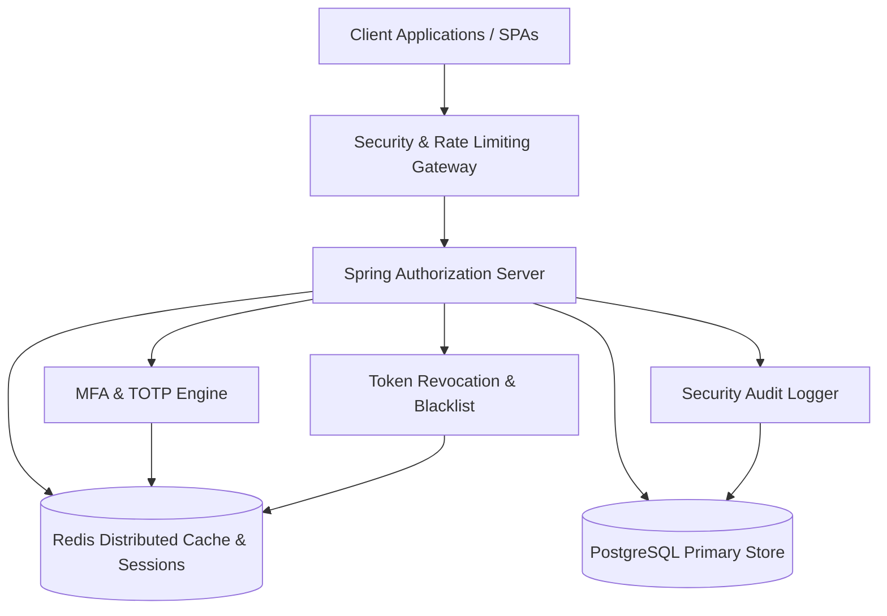

# IAM Server - Architecture & Threat Model Specification

Comprehensive technical design and security architecture document for the Identity and Access Management (IAM) Server.

---

## 1. High-Level Architecture

---

## 2. Security Defense-in-Depth Layers

1. **Network & Edge:** Rate limiting filter (5 requests/60s) blocks credential stuffing and brute-force attacks at the gateway level.
2. **Authentication Tier:** BCrypt password hashing (cost factor 10), RFC 6238 TOTP two-step verification, and temporary challenge tokens.
3. **Authorization Tier:** Role-Based Access Control (RBAC) with dynamic database roles (`ROLE_ADMIN`, `ROLE_USER`) and fine-grained authorities.
4. **Token Security:** Asymmetric RSA-2048 signed JWTs, short-lived authorization codes (5 min), and Redis-backed instant token blacklisting.
5. **Audit & Compliance:** Persistent PostgreSQL audit logging for all authentication attempts, privilege escalations, and security events.

---

## 3. Threat Model & Mitigation Matrix

| Threat | Risk Level | Mitigation Strategy Implemented |
|---|---|---|
| **Brute Force / Credential Stuffing** | HIGH | `RateLimitingFilter` enforces 5 req/min per IP with HTTP 429 response. |
| **Token Theft / Replay** | HIGH | `TokenRevocationService` allows instant blacklisting and multi-device force logout. |
| **Stolen Password Compromise** | HIGH | RFC 6238 TOTP (Google Authenticator) + Out-of-band SMS/Email OTP challenge. |
| **Privilege Escalation** | MEDIUM | Method-level security (`@PreAuthorize("hasRole('ADMIN')")`) verified against DB. |
| **Clickjacking / Framing** | MEDIUM | HTTP `X-Frame-Options: SAMEORIGIN` and Content Security Policy headers enforced. |
| **Tampered JWT Claims** | HIGH | Cryptographic RSA-2048 asymmetric signatures verified on all incoming requests. |
